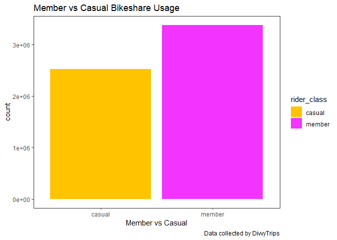
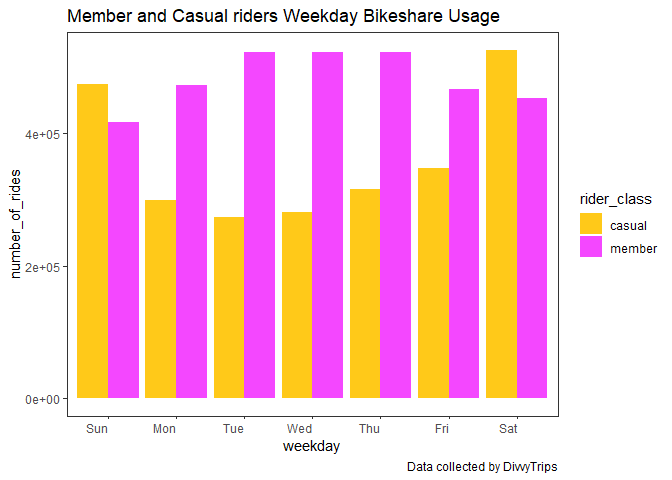
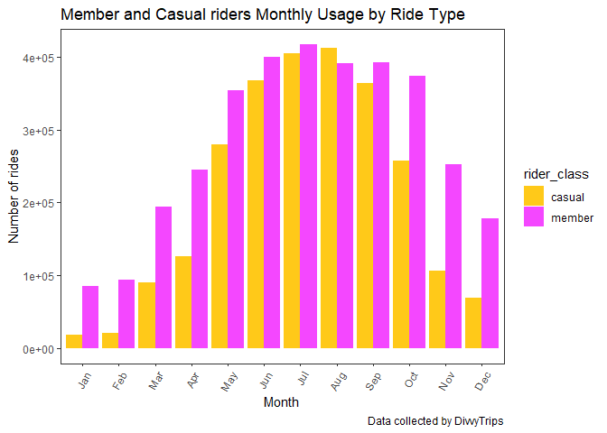
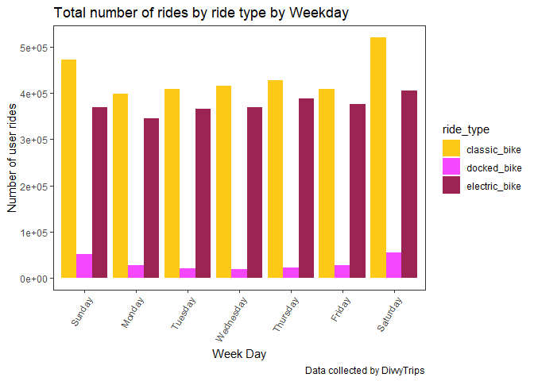
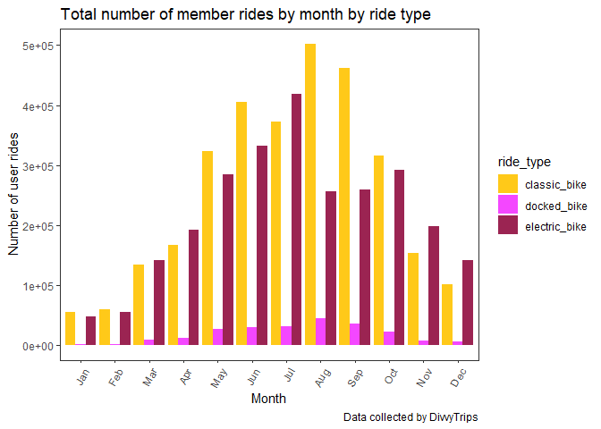

Bikeshare Capstone
================
Olusesi Olabode
2022-09-01

## GDAC Capstone Project

------------------------------------------------------------------------

### About Me

Hi everyone, welcome to my capstone project for the Google Data
Analytics Certification which I recently completed. Assigned a
fictitious junior data analyst role, I will be answering key business
questions for Cyclistic bikeshare company using the **6** steps of the
data analysis process. The data I will be using has been made available
by Motivate International Inc. under this
[license](https://ride.divvybikes.com/data-license-agreement).

------------------------------------------------------------------------

### About Cyclistic

The company has a fleet of 5,824 bicycles that are geotracked and locked
into a network of 692 stations across Chicago. Until now, Cyclistic’s
marketing strategy relied on building general awareness and appealing to
broad consumer segments by leveraging on the flexibility of its pricing
plans: single-ride passes, full-day passes, and annual memberships.
Customers who purchase single-ride or full-day passes are referred to as
**casual riders** while those who purchase annual memberships are
**Cyclistic members**.

My manager, Lily Moreno - the director of marketing, has tasked me with
the responsibility of analyzing historical bike usage data to better
understand how casual riders and annual members use Cyclistic bikes
differently, identify trends, and come up with a data-driven marketing
strategy that can help convert casual members to annual members. Getting
down quickly to work, I asked key questions during the *Ask Phase*.

------------------------------------------------------------------------

### Ask Phase

Based on the problem I am trying to solve and the need to draw the right
insights that will help drive future business decisions, I have to
answer these key business questions: \* How do annual members and casual
riders use Cyclistic bikes differently? \* Why would casual riders buy
Cyclistic annual memberships? \* How can Cyclistic use digital media to
influence casual riders to become members?

Helping my team to understand how members and casual riders use
Cyclistic bikes differently would give my team data-driven guidance to
design a marketing strategy which will help Cyclistic achieve its
primary objective of converting casual riders into annual members. Next,
I need to get the data to be used for my analysis ready in the *Prepare
Phase*.

------------------------------------------------------------------------

### Prepare Phase

The data to be used was made available by Motivate International
Inc. under this
[license](https://ride.divvybikes.com/data-license-agreement), and the
last 12 months data was downloaded and imported into R Studio for
analysis. The data was checked for bias, credibility and integrity to
confirm that it `R-O-C-C-Cs`: \* R - Reliable \* O - Original \* C -
Comprehensive \* C - Current \* C - Cited

I have decided to use R for this project, and as I have downloaded my
data, I need to set the appropriate working directory within my tool to
enable me save my progress for easy access to my project anytime:

``` r
getwd()
C:/Users/USER/Desktop/Projects/Project/Tripdata
setwd("C:/Users/USER/Desktop/Projects/Project/Tripdata")
```

``` r
#save my workspace
save.image("myRCapstone.Rdata")
#save my work history
savehistory("myRCapstone.Rhistory")
```

Over to the *Process Phase* now, let’s go!

------------------------------------------------------------------------

### Process Phase

Since I have decided to use R for this project as it will allow me
process, analyze, and quickly visualize my findings for sharing in one
place. I might consider exporting the processed data from R to Tableau
or Power BI in the future to create even more compelling visualizations🤷‍️

-   Install and load all required packages

``` r
library(tidyverse)
```

    ## ── Attaching packages ─────────────────────────────────────── tidyverse 1.3.2 ──
    ## ✔ ggplot2 3.3.6     ✔ purrr   0.3.4
    ## ✔ tibble  3.1.8     ✔ dplyr   1.0.9
    ## ✔ tidyr   1.2.0     ✔ stringr 1.4.1
    ## ✔ readr   2.1.2     ✔ forcats 0.5.2
    ## ── Conflicts ────────────────────────────────────────── tidyverse_conflicts() ──
    ## ✖ dplyr::filter() masks stats::filter()
    ## ✖ dplyr::lag()    masks stats::lag()

``` r
library(lubridate)
```

    ## 
    ## Attaching package: 'lubridate'
    ## 
    ## The following objects are masked from 'package:base':
    ## 
    ##     date, intersect, setdiff, union

``` r
library(ggplot2)
```

-   To ensure I’m working on the data that represents the most current
    behaviour of the different rider classes, past 12 months data was
    downloaded and imported to R:

``` r
ride_202108 <- read.csv("202108-divvy-tripdata.csv")
ride_202109 <- read.csv("202109-divvy-tripdata.csv")
ride_202110 <- read.csv("202110-divvy-tripdata.csv")
ride_202111 <- read.csv("202111-divvy-tripdata.csv")
ride_202112 <- read.csv("202112-divvy-tripdata.csv")
ride_202201 <- read.csv("202201-divvy-tripdata.csv")
ride_202202 <- read.csv("202202-divvy-tripdata.csv")
ride_202203 <- read.csv("202203-divvy-tripdata.csv")
ride_202204 <- read.csv("202204-divvy-tripdata.csv")
ride_202205 <- read.csv("202205-divvy-tripdata.csv")
ride_202206 <- read.csv("202206-divvy-tripdata.csv")
ride_202207 <- read.csv("202207-divvy-tripdata.csv")
ride_202208 <- read.csv("202208-divvy-tripdata.csv")
```

-   Creating a **ride_data** dataframe that contains all the past 12
    months:

``` r
ride_data <- rbind(ride_202108, ride_202109, ride_202110, ride_202111, ride_202112, ride_202201, ride_202202, ride_202203, ride_202204, ride_202205, ride_202206, ride_202207)
```

-   Confirming the data structure of the dataframe:

``` r
str(ride_data)
```

    ## 'data.frame':    5901463 obs. of  13 variables:
    ##  $ ride_id           : chr  "99103BB87CC6C1BB" "EAFCCCFB0A3FC5A1" "9EF4F46C57AD234D" "5834D3208BFAF1DA" ...
    ##  $ rideable_type     : chr  "electric_bike" "electric_bike" "electric_bike" "electric_bike" ...
    ##  $ started_at        : chr  "2021-08-10 17:15:49" "2021-08-10 17:23:14" "2021-08-21 02:34:23" "2021-08-21 06:52:55" ...
    ##  $ ended_at          : chr  "2021-08-10 17:22:44" "2021-08-10 17:39:24" "2021-08-21 02:50:36" "2021-08-21 07:08:13" ...
    ##  $ start_station_name: chr  "" "" "" "" ...
    ##  $ start_station_id  : chr  "" "" "" "" ...
    ##  $ end_station_name  : chr  "" "" "" "" ...
    ##  $ end_station_id    : chr  "" "" "" "" ...
    ##  $ start_lat         : num  41.8 41.8 42 42 41.8 ...
    ##  $ start_lng         : num  -87.7 -87.7 -87.7 -87.7 -87.6 ...
    ##  $ end_lat           : num  41.8 41.8 42 42 41.8 ...
    ##  $ end_lng           : num  -87.7 -87.6 -87.7 -87.7 -87.6 ...
    ##  $ member_casual     : chr  "member" "member" "member" "member" ...

The output shows that the new ride_data dataframe has a total of 5901463
observations(rows) and 13 variables(columns) of data.

-   Cleaning of the data in the dataframe was done usung these 8 steps:
    +Confirm column names to see if the variables transmit the message I
    want to pass across

``` r
colnames(ride_data)
```

    ##  [1] "ride_id"            "rideable_type"      "started_at"        
    ##  [4] "ended_at"           "start_station_name" "start_station_id"  
    ##  [7] "end_station_name"   "end_station_id"     "start_lat"         
    ## [10] "start_lng"          "end_lat"            "end_lng"           
    ## [13] "member_casual"

-   Rename 2 variables using code below:

``` r
ride_data <- ride_data %>%
  rename(ride_type = rideable_type, rider_class = member_casual)
```

-   Remove all duplicate values using the ride_id column as primary key
    and return only unique values, then store in **ridedata_wd** as ride
    data without duplicates.

``` r
ridedata_wd <- ride_data[!duplicated(ride_data$ride_id),]
print(paste(nrow(ride_data) - nrow(ridedata_wd), "duplicated rows removed"))
```

    ## [1] "0 duplicated rows removed"

This confirms that there are no duplicated rows in my dataframe

``` r
#Query the first 6 rowa of my dataframe without duplicates
head(ridedata_wd)
```

    ##            ride_id     ride_type          started_at            ended_at
    ## 1 99103BB87CC6C1BB electric_bike 2021-08-10 17:15:49 2021-08-10 17:22:44
    ## 2 EAFCCCFB0A3FC5A1 electric_bike 2021-08-10 17:23:14 2021-08-10 17:39:24
    ## 3 9EF4F46C57AD234D electric_bike 2021-08-21 02:34:23 2021-08-21 02:50:36
    ## 4 5834D3208BFAF1DA electric_bike 2021-08-21 06:52:55 2021-08-21 07:08:13
    ## 5 CD825CB87ED1D096 electric_bike 2021-08-19 11:55:29 2021-08-19 12:04:11
    ## 6 612F12C94A964F3E electric_bike 2021-08-19 12:41:12 2021-08-19 12:47:47
    ##   start_station_name start_station_id end_station_name end_station_id start_lat
    ## 1                                                                         41.77
    ## 2                                                                         41.77
    ## 3                                                                         41.95
    ## 4                                                                         41.97
    ## 5                                                                         41.79
    ## 6                                                                         41.81
    ##   start_lng end_lat end_lng rider_class
    ## 1    -87.68   41.77  -87.68      member
    ## 2    -87.68   41.77  -87.63      member
    ## 3    -87.65   41.97  -87.66      member
    ## 4    -87.67   41.95  -87.65      member
    ## 5    -87.60   41.77  -87.62      member
    ## 6    -87.61   41.80  -87.60      member

-   Parse the date-time column from character (string) format to a
    POSIXct. format using the as. POSIXct method and store both date and
    time with an associated time zone.

``` r
ridedata_wd$started_at <- as.POSIXct(ridedata_wd$started_at, "%Y-%m-%d %H:%M:%S", tz= "GMT")
ridedata_wd$ended_at <- as.POSIXct(ridedata_wd$ended_at, "%Y-%m-%d %H:%M:%S", tz="GMT")
```

-   Add columns that list the date, day, month and year of each ride
    which will help to estimate ride data for each month, day, or year.

``` r
ridedata_wd$date <- as.Date(ridedata_wd$started_at)
ridedata_wd$day <- format(as.Date(ridedata_wd$date), "%d")
ridedata_wd$month <- format(as.Date(ridedata_wd$date), "%m")
ridedata_wd$year <- format(as.Date(ridedata_wd$date), "%Y")
ridedata_wd$day_of_week <- format(as.Date(ridedata_wd$date), "%A")
```

-   Create a “ride_length” column to calculate the length of each ride
    by subtracting the column “started_at” from the column “ended_at”.

``` r
ridedata_wd$ride_length <- difftime(ridedata_wd$ended_at, ridedata_wd$started_at)
```

``` r
#Confirm the data structure again at this point to show newly added columns
str(ridedata_wd)
```

    ## 'data.frame':    5901463 obs. of  19 variables:
    ##  $ ride_id           : chr  "99103BB87CC6C1BB" "EAFCCCFB0A3FC5A1" "9EF4F46C57AD234D" "5834D3208BFAF1DA" ...
    ##  $ ride_type         : chr  "electric_bike" "electric_bike" "electric_bike" "electric_bike" ...
    ##  $ started_at        : POSIXct, format: "2021-08-10 17:15:49" "2021-08-10 17:23:14" ...
    ##  $ ended_at          : POSIXct, format: "2021-08-10 17:22:44" "2021-08-10 17:39:24" ...
    ##  $ start_station_name: chr  "" "" "" "" ...
    ##  $ start_station_id  : chr  "" "" "" "" ...
    ##  $ end_station_name  : chr  "" "" "" "" ...
    ##  $ end_station_id    : chr  "" "" "" "" ...
    ##  $ start_lat         : num  41.8 41.8 42 42 41.8 ...
    ##  $ start_lng         : num  -87.7 -87.7 -87.7 -87.7 -87.6 ...
    ##  $ end_lat           : num  41.8 41.8 42 42 41.8 ...
    ##  $ end_lng           : num  -87.7 -87.6 -87.7 -87.7 -87.6 ...
    ##  $ rider_class       : chr  "member" "member" "member" "member" ...
    ##  $ date              : Date, format: "2021-08-10" "2021-08-10" ...
    ##  $ day               : chr  "10" "10" "21" "21" ...
    ##  $ month             : chr  "08" "08" "08" "08" ...
    ##  $ year              : chr  "2021" "2021" "2021" "2021" ...
    ##  $ day_of_week       : chr  "Tuesday" "Tuesday" "Saturday" "Saturday" ...
    ##  $ ride_length       : 'difftime' num  415 970 973 918 ...
    ##   ..- attr(*, "units")= chr "secs"

-   Convert “ride_length” column from factor to numeric so we can run
    calculations on the data.

``` r
is.factor(ridedata_wd$ride_length)
```

    ## [1] FALSE

``` r
ridedata_wd$ride_length <- as.numeric(as.character(ridedata_wd$ride_length))
is.numeric(ridedata_wd$ride_length)
```

    ## [1] TRUE

-   Remove bad data by identifying rows where ride_length was negative,
    as these represent days when bikes were taken out of docks for
    quality checks.

``` r
nrow(subset(ridedata_wd, ride_length < 0))
```

    ## [1] 149

The result shows that I will have to remove **149** rows of data which
returned negative ride length values. + Create a new version of the
dataframe (v2) since data is being removed

``` r
ridedata_wd_v2 <- ridedata_wd[!(ridedata_wd$start_station_name == "HQ QR" | ridedata_wd$ride_length<0),]
```

``` r
#Remove null values from my data and return to the new dataframe version
ridedata_wd_v2 <- ridedata_wd_v2 %>% na.omit()
```

``` r
#Take a glimpse at all the columns, their datatype and few of their rows
glimpse(ridedata_wd_v2)
```

    ## Rows: 5,895,724
    ## Columns: 19
    ## $ ride_id            <chr> "99103BB87CC6C1BB", "EAFCCCFB0A3FC5A1", "9EF4F46C57…
    ## $ ride_type          <chr> "electric_bike", "electric_bike", "electric_bike", …
    ## $ started_at         <dttm> 2021-08-10 17:15:49, 2021-08-10 17:23:14, 2021-08-…
    ## $ ended_at           <dttm> 2021-08-10 17:22:44, 2021-08-10 17:39:24, 2021-08-…
    ## $ start_station_name <chr> "", "", "", "", "", "", "", "", "", "", "", "", "",…
    ## $ start_station_id   <chr> "", "", "", "", "", "", "", "", "", "", "", "", "",…
    ## $ end_station_name   <chr> "", "", "", "", "", "", "", "Clark St & Grace St", …
    ## $ end_station_id     <chr> "", "", "", "", "", "", "", "TA1307000127", "", "",…
    ## $ start_lat          <dbl> 41.77000, 41.77000, 41.95000, 41.97000, 41.79000, 4…
    ## $ start_lng          <dbl> -87.68000, -87.68000, -87.65000, -87.67000, -87.600…
    ## $ end_lat            <dbl> 41.77000, 41.77000, 41.97000, 41.95000, 41.77000, 4…
    ## $ end_lng            <dbl> -87.68000, -87.63000, -87.66000, -87.65000, -87.620…
    ## $ rider_class        <chr> "member", "member", "member", "member", "member", "…
    ## $ date               <date> 2021-08-10, 2021-08-10, 2021-08-21, 2021-08-21, 20…
    ## $ day                <chr> "10", "10", "21", "21", "19", "19", "19", "13", "17…
    ## $ month              <chr> "08", "08", "08", "08", "08", "08", "08", "08", "08…
    ## $ year               <chr> "2021", "2021", "2021", "2021", "2021", "2021", "20…
    ## $ day_of_week        <chr> "Tuesday", "Tuesday", "Saturday", "Saturday", "Thur…
    ## $ ride_length        <dbl> 415, 970, 973, 918, 522, 395, 941, 341, 18, 1047, 3…

I now have **5,895,724** rows of data in my dataframe which I would be
using for my *Analyse Phase*.

------------------------------------------------------------------------

### Analyze Phase

-   Conduct descriptive analysis of my dataframe, then get a summary
    which presents an overview of the entire dataframe.

``` r
mean(ridedata_wd_v2$ride_length)
```

    ## [1] 1068.424

``` r
median(ridedata_wd_v2$ride_length)
```

    ## [1] 657

``` r
max(ridedata_wd_v2$ride_length)
```

    ## [1] 2497750

``` r
min(ridedata_wd_v2$ride_length)
```

    ## [1] 0

``` r
summary(ridedata_wd_v2)
```

    ##    ride_id           ride_type           started_at                    
    ##  Length:5895724     Length:5895724     Min.   :2021-08-01 00:00:04.00  
    ##  Class :character   Class :character   1st Qu.:2021-09-27 12:28:09.00  
    ##  Mode  :character   Mode  :character   Median :2022-02-14 11:53:23.50  
    ##                                        Mean   :2022-01-31 21:19:16.83  
    ##                                        3rd Qu.:2022-06-05 15:18:32.00  
    ##                                        Max.   :2022-07-31 23:59:58.00  
    ##     ended_at                      start_station_name start_station_id  
    ##  Min.   :2021-08-01 00:03:11.00   Length:5895724     Length:5895724    
    ##  1st Qu.:2021-09-27 12:47:44.25   Class :character   Class :character  
    ##  Median :2022-02-14 12:06:38.00   Mode  :character   Mode  :character  
    ##  Mean   :2022-01-31 21:37:05.25                                        
    ##  3rd Qu.:2022-06-05 15:43:31.00                                        
    ##  Max.   :2022-08-01 13:26:03.00                                        
    ##  end_station_name   end_station_id       start_lat       start_lng     
    ##  Length:5895724     Length:5895724     Min.   :41.64   Min.   :-87.84  
    ##  Class :character   Class :character   1st Qu.:41.88   1st Qu.:-87.66  
    ##  Mode  :character   Mode  :character   Median :41.90   Median :-87.64  
    ##                                        Mean   :41.90   Mean   :-87.65  
    ##                                        3rd Qu.:41.93   3rd Qu.:-87.63  
    ##                                        Max.   :45.64   Max.   :-73.80  
    ##     end_lat         end_lng       rider_class             date           
    ##  Min.   :41.39   Min.   :-88.97   Length:5895724     Min.   :2021-08-01  
    ##  1st Qu.:41.88   1st Qu.:-87.66   Class :character   1st Qu.:2021-09-27  
    ##  Median :41.90   Median :-87.64   Mode  :character   Median :2022-02-14  
    ##  Mean   :41.90   Mean   :-87.65                      Mean   :2022-01-31  
    ##  3rd Qu.:41.93   3rd Qu.:-87.63                      3rd Qu.:2022-06-05  
    ##  Max.   :42.37   Max.   :-87.50                      Max.   :2022-07-31  
    ##      day               month               year           day_of_week       
    ##  Length:5895724     Length:5895724     Length:5895724     Length:5895724    
    ##  Class :character   Class :character   Class :character   Class :character  
    ##  Mode  :character   Mode  :character   Mode  :character   Mode  :character  
    ##                                                                             
    ##                                                                             
    ##                                                                             
    ##   ride_length     
    ##  Min.   :      0  
    ##  1st Qu.:    370  
    ##  Median :    657  
    ##  Mean   :   1068  
    ##  3rd Qu.:   1186  
    ##  Max.   :2497750

-   Now, let’s start answering the business questions by comparing data
    about casual and member riders.

1.  Obtain a statistical summary of ride_length by rider_class

``` r
ridedata_wd_v2 %>%
  group_by(rider_class) %>%
  summarise(avg_ride_length = mean(ride_length), median_ride_length = median(ride_length), max_ride_length = max(ride_length), min_ride_length = min(ride_length))
```

    ## # A tibble: 2 × 5
    ##   rider_class avg_ride_length median_ride_length max_ride_length min_ride_length
    ##   <chr>                 <dbl>              <dbl>           <dbl>           <dbl>
    ## 1 casual                1482.                863         2497750               0
    ## 2 member                 760.                541           89996               0

2.  Estimate the percentage ride_length covered by members versus
    casual.

``` r
ridedata_wd_v2 %>%
  group_by(rider_class) %>%
  summarise(count = length(ride_id), 'ride_taken(%)' = (length(ride_id) / nrow(ridedata_wd_v2)) * 100)
```

    ## # A tibble: 2 × 3
    ##   rider_class   count `ride_taken(%)`
    ##   <chr>         <int>           <dbl>
    ## 1 casual      2517369            42.7
    ## 2 member      3378355            57.3

3.  Let’s view the average ride time by each day for members vs casual
    riders

``` r
#I will arrange the days of the week in the right order first
ridedata_wd_v2$day_of_week <- ordered(ridedata_wd_v2$day_of_week, levels=c("Sunday", "Monday", "Tuesday", "Wednesday", "Thursday", "Friday", "Saturday"))
```

``` r
#Then, obtain the average ride time by each day for members vs casual riders
aggregate(ridedata_wd_v2$ride_length ~ ridedata_wd_v2$rider_class + ridedata_wd_v2$day_of_week, FUN = mean)
```

    ##    ridedata_wd_v2$rider_class ridedata_wd_v2$day_of_week
    ## 1                      casual                     Sunday
    ## 2                      member                     Sunday
    ## 3                      casual                     Monday
    ## 4                      member                     Monday
    ## 5                      casual                    Tuesday
    ## 6                      member                    Tuesday
    ## 7                      casual                  Wednesday
    ## 8                      member                  Wednesday
    ## 9                      casual                   Thursday
    ## 10                     member                   Thursday
    ## 11                     casual                     Friday
    ## 12                     member                     Friday
    ## 13                     casual                   Saturday
    ## 14                     member                   Saturday
    ##    ridedata_wd_v2$ride_length
    ## 1                   1719.1204
    ## 2                    856.6393
    ## 3                   1531.2856
    ## 4                    738.6934
    ## 5                   1291.0836
    ## 6                    713.8310
    ## 7                   1271.7207
    ## 8                    719.0194
    ## 9                   1308.3803
    ## 10                   728.2798
    ## 11                  1373.0453
    ## 12                   741.7726
    ## 13                  1627.3740
    ## 14                   851.0638

4.  Using wday() to create a weekday column, let’s calculate the average
    number of rides and ride length by rider class for each day of the
    week.

``` r
ridedata_wd_v2 %>%
  mutate(weekday = wday(started_at, label = TRUE)) %>%
  group_by(rider_class, weekday) %>%
  summarise(number_of_rides = n(), avg_duration = mean(ride_length)) %>%
  arrange(rider_class, weekday)
```

    ## `summarise()` has grouped output by 'rider_class'. You can override using the
    ## `.groups` argument.

    ## # A tibble: 14 × 4
    ## # Groups:   rider_class [2]
    ##    rider_class weekday number_of_rides avg_duration
    ##    <chr>       <ord>             <int>        <dbl>
    ##  1 casual      Sun              474596        1719.
    ##  2 casual      Mon              299079        1531.
    ##  3 casual      Tue              273307        1291.
    ##  4 casual      Wed              281327        1272.
    ##  5 casual      Thu              315539        1308.
    ##  6 casual      Fri              346999        1373.
    ##  7 casual      Sat              526522        1627.
    ##  8 member      Sun              417823         857.
    ##  9 member      Mon              472281         739.
    ## 10 member      Tue              523262         714.
    ## 11 member      Wed              522524         719.
    ## 12 member      Thu              522537         728.
    ## 13 member      Fri              466558         742.
    ## 14 member      Sat              453370         851.

5.  Finally, estimate the monthly rate of bike usage by each user class
    and obtain the percentage difference between them.

``` r
#I would like to recode my month column to show name of month instead of number
ridedata_wd_v2 <-  ridedata_wd_v2 %>% 
  mutate(month = recode(month, "01" = "Jan","02" = "Feb","03" = "Mar","04" = "Apr","05" = "May","06" = "Jun","07" = "Jul","08" = "Aug","09" = "Sep","10" = "Oct","11" = "Nov","12" = "Dec"))
```

``` r
#I will also arrange the month in chronological order so that my output is ordered
ridedata_wd_v2$month <- ordered(ridedata_wd_v2$month, levels=c("Jan","Feb","Mar","Apr","May","Jun","Jul","Aug","Sep","Oct","Nov","Dec"))
```

``` r
ridedata_wd_v2 %>%
  group_by(month) %>%
  summarise(count = length(ride_id),
            'ride_taken(%)' = (length(ride_id) / nrow(ridedata_wd_v2)) * 100,
            'members_p' = (sum(rider_class == "member") / length(ride_id)) * 100,
            'casual_p' = (sum(rider_class == "casual") / length(ride_id)) * 100,
            'Member vs Casual(% Diff)' = members_p - casual_p )
```

    ## # A tibble: 12 × 6
    ##    month  count `ride_taken(%)` members_p casual_p `Member vs Casual(% Diff)`
    ##    <ord>  <int>           <dbl>     <dbl>    <dbl>                      <dbl>
    ##  1 Jan   103684            1.76      82.2     17.8                      64.4 
    ##  2 Feb   115532            1.96      81.5     18.5                      63.0 
    ##  3 Mar   283774            4.81      68.4     31.6                      36.8 
    ##  4 Apr   370932            6.29      66.0     34.0                      32.0 
    ##  5 May   634135           10.8       55.9     44.1                      11.8 
    ##  6 Jun   768137           13.0       52.1     47.9                       4.16
    ##  7 Jul   822525           14.0       50.7     49.3                       1.48
    ##  8 Aug   803617           13.6       48.7     51.3                      -2.56
    ##  9 Sep   755516           12.8       51.9     48.1                       3.78
    ## 10 Oct   630742           10.7       59.3     40.7                      18.6 
    ## 11 Nov   359734            6.10      70.3     29.7                      40.6 
    ## 12 Dec   247396            4.20      71.9     28.1                      43.7

The analyses and modifications done to the data would make the
visualizations I’d be creating in the *Share Phase* more readable.

------------------------------------------------------------------------

### Share Phase

-   First, let’s visualize the number of times each of rider class
    (members versus casual) used the bikeshare service.

``` r
ggplot(ridedata_wd_v2, aes(rider_class, fill = rider_class)) +
  geom_bar() +
  labs( x = "Member vs Casual", title = "Member vs Casual Bikeshare Usage", caption = "Data collected by DivvyTrips") +
  theme_bw() +
  theme(panel.grid.major = element_blank(),
        panel.grid.minor = element_blank()
        ) + 
  scale_fill_manual(values = c("#FFC300", "#F333FF"))
```

<!-- -->

It’s obvious that more member users patronized the company when compared
to the casual riders which justifies the need to find means to **convert
the casual riders to annual members**.

-   I would like to know which day of the week is the peak usage day for
    each of the categories of rider class that I have

``` r
ridedata_wd_v2 %>%
  mutate(weekday = wday(started_at, label = TRUE)) %>%
  group_by(rider_class, weekday) %>%
  summarise(number_of_rides = n(), avg_duration = mean(ride_length)) %>%
  arrange(rider_class, weekday) %>%
  ggplot(aes(weekday, number_of_rides, fill = rider_class)) +
  labs(title = "Member and Casual riders Weekday Bikeshare Usage", caption = "Data collected by DivvyTrips") +
  theme_bw() +
  theme(panel.grid.major = element_blank(),
        panel.grid.minor = element_blank(),
    axis.text.x = element_text(hjust = 1)) +
  geom_col(position = "dodge", alpha = 0.9) +
  scale_fill_manual(values = c("#FFC300", "#F333FF"))
```

    ## `summarise()` has grouped output by 'rider_class'. You can override using the
    ## `.groups` argument.

<!-- -->

This clearly shows that while registered members used the bikeshare
service more during the week, the casual members patronize Cyclistic
more during weekends. This triggers the need to consider targeting more
of the ads and promotions to users who patronize over the weekend.

-   Now, let’s see how member and casual rider patronage varies for each
    month in the past 1 year

``` r
ridedata_wd_v2 %>% 
  group_by(rider_class, month) %>% 
  summarise(number_of_rides = n(), avg_duration = mean(ride_length)) %>% 
  arrange(rider_class, month) %>% 
  ggplot(aes(month, number_of_rides, fill = rider_class)) +
  geom_col(position = "dodge", alpha = 0.9) + 
  labs(title = "Member and Casual riders Monthly Usage by Ride Type", x = "Month", y = "Number of rides", caption = "Data collected by DivvyTrips") + 
  theme_bw() +
  theme(panel.grid.major = element_blank(),
        panel.grid.minor = element_blank(),
        axis.text.x = element_text(angle = 60, hjust = 1)
  ) +
  scale_fill_manual(values = c("#FFC300", "#F333FF"))
```

    ## `summarise()` has grouped output by 'rider_class'. You can override using the
    ## `.groups` argument.

<!-- -->

The patronage of annual members clearly trumps that of casual members
through out the year, though we have significant similarity of usage
during the 3 mid months of the year (Jun - Aug) and disparity during the
last 3 months of the year (Oct - Dec).

-   Next, I want to visualize which of the available bike type options
    is the most popular on each day of the week

``` r
ridedata_wd_v2 %>% 
  group_by(ride_type, day_of_week) %>% 
  summarise(number_of_rides = n(), average_duration = mean(ride_length)) %>% 
  arrange(ride_type, day_of_week)%>% 
  ggplot(aes(day_of_week, number_of_rides, fill = ride_type)) +
  geom_col(position = "dodge", alpha = 0.9) + 
  labs(title = "Total number of rides by ride type by Weekday", 
       x = "Week Day", 
       y = "Number of user rides", caption = "Data collected by DivvyTrips") + 
  theme_bw() +
  theme(panel.grid.major = element_blank(),
        panel.grid.minor = element_blank(),
        axis.text.x = element_text(angle = 60, hjust = 1)
  ) +
  scale_fill_manual(values = c("#FFC300", "#F333FF", "#900C3F")) 
```

    ## `summarise()` has grouped output by 'ride_type'. You can override using the
    ## `.groups` argument.

<!-- -->

The *classic bike* is the most popular bike option throughout the week,
followed by the *electric_bike*, then the *docked_bike*. Promotions in
the form of discounts or book one get one free ride should be available
all week long on the classic bike option.

-   Finally, I want to visualize which of the available bike type
    options is the most popular on each month of the year

``` r
ridedata_wd_v2 %>% 
  group_by(ride_type, month) %>% 
  summarise(number_of_rides = n(), average_duration = mean(ride_length)) %>% 
  arrange(ride_type, month) %>% 
  ggplot(aes(month, number_of_rides, fill = ride_type)) +
  geom_col(position = "dodge", alpha = 0.9) + 
  labs(title = "Total number of member rides by month by ride type", 
       x = "Month", 
       y = "Number of user rides", caption = "Data collected by DivvyTrips") + 
  theme_bw() +
  theme(panel.grid.major = element_blank(),
        panel.grid.minor = element_blank(),
        axis.text.x = element_text(angle = 60, hjust = 1)
  ) +
  scale_fill_manual(values = c("#FFC300", "#F333FF", "#900C3F"))
```

    ## `summarise()` has grouped output by 'ride_type'. You can override using the
    ## `.groups` argument.

<!-- -->

The *classic_bike* is the most popular bike option for the first 10
months of the year, while the *electric_bike* enjoyed more patronage in
the last 2 months of year, which may mean that its popularity is growing
among users. We can confidently argue that Cyclistic should look at
making the *classic_bike* available all year round, while increasing the
number of electric_bike in circulation in the last 2 months of the year
.

------------------------------------------------------------------------

### Act Phase

After all the analysis done to draw insights and the visualizations
created to see trends in the past 12 month bike-share data, I can now
confidently present my top 3 data-driven recommendations to my manager,
Lily Moreno:

1.  Since it’s clear that more annual members use the bikeshare service
    than causal members, we need to trigger targeted ads that contain
    discounted pricing of membership registration to users who are
    booking bikeshare service during weekends through digital media as
    many of them are unregistered.

2.  The monthly usage of the bikeshare service justifies the need to
    introduce a buy-one-get-one-free offer to users with membership
    status in the last 3 months of the year. This way, we can increase
    patronage of the annual members (which is considerably lower) whilst
    also leaving casual members little choice but to sign up as members
    in order to enjoy this offer as well.

3.  On the average, the classic bike is the most popular bike type among
    users either on a weekly or monthly basis, and this makes ensuring
    its availability all week long and all year round very imperative in
    order to guarantee customer retention. The electric bike is most
    popular during the last 2 months of the year and this should be made
    available during these months to cater to the predicted demand.

### Conclusion

I can confidently conclude that converting casual users to annual
members is a very good initiative by the stakeholders and we have facts
which show that this will positively impact the Cyclistic’s revenue,
reduce user attrition, and guarantee the sustenance of the business.

My unreserved gratitude goes to Google for putting together a very
elaborate and comprehensive course on Data Analytics on Coursera for all
and sundry, especially the under-represented communities like mine, and
also making it possible to be considered for financial aid which makes
it inexcusable not to pursue dreams.

I would also want to acknowledge Alex Freberg for his top-notch videos
which gave me a sense of direction as to the right course, tools, and
approach to achieving this dream of mine. Kudos to the entire R
community, especially R 101 Youtube channel for their excellent content
on R programming.
